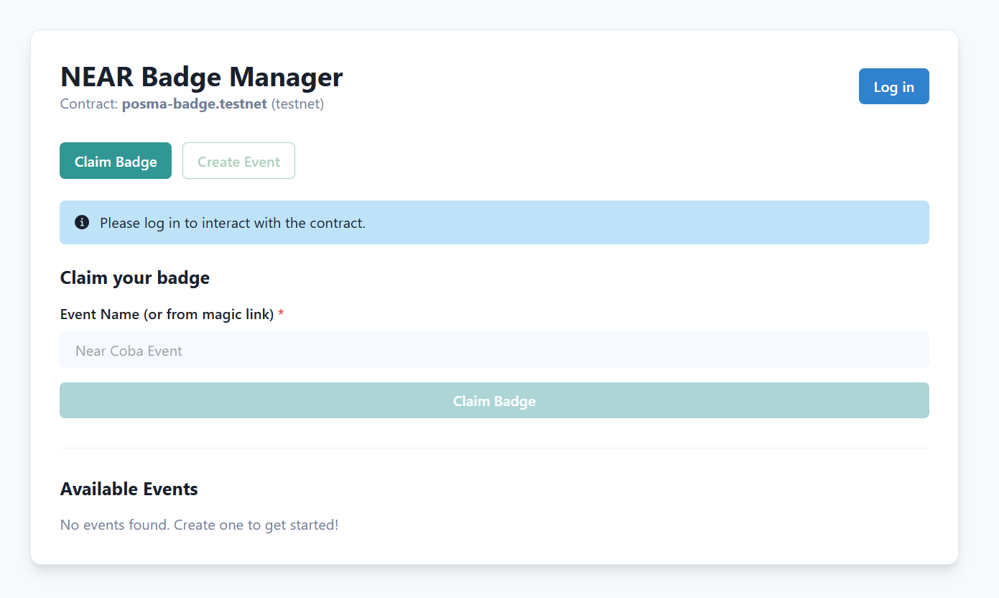
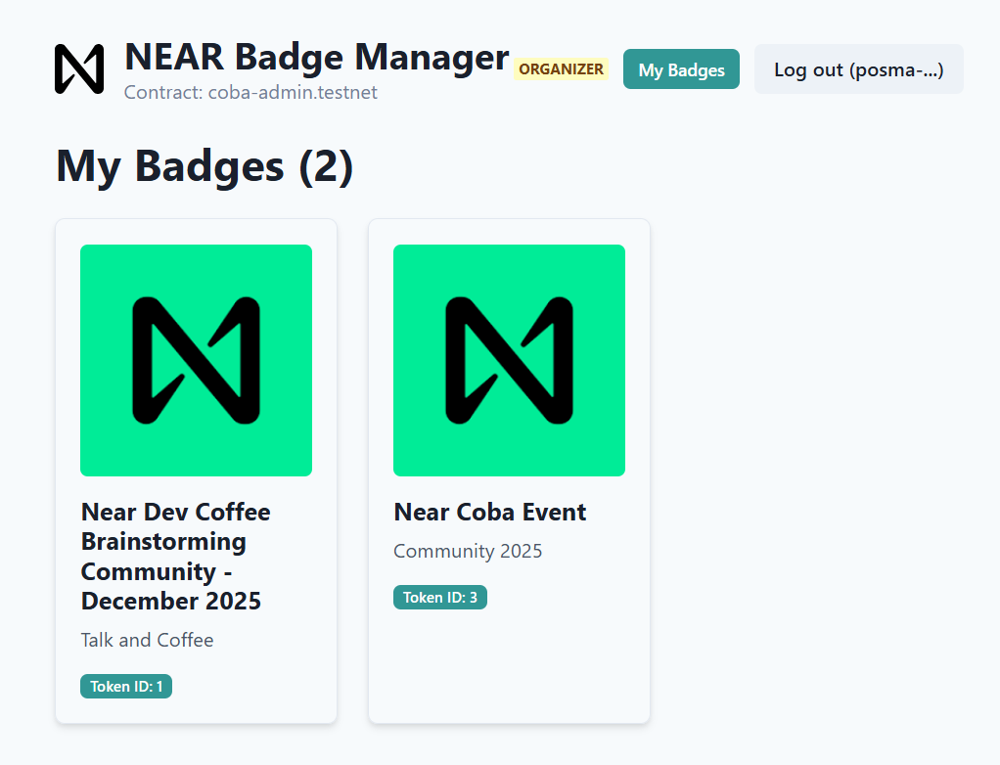
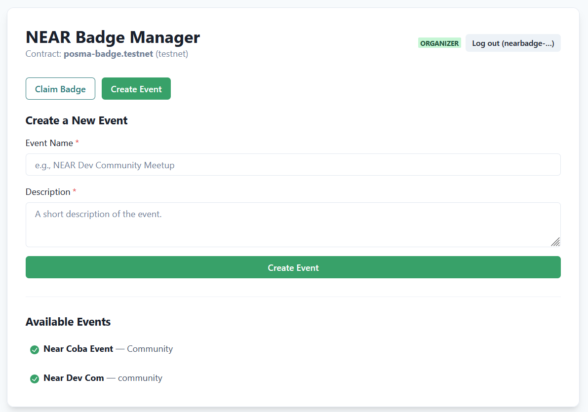
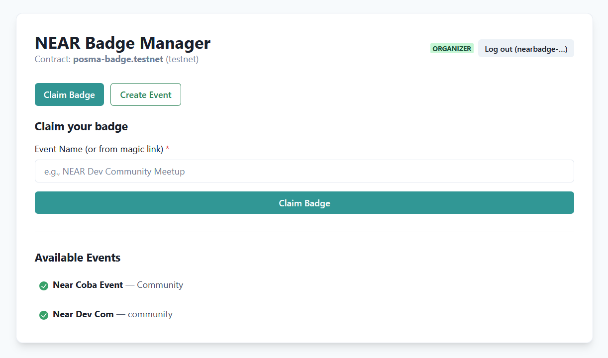
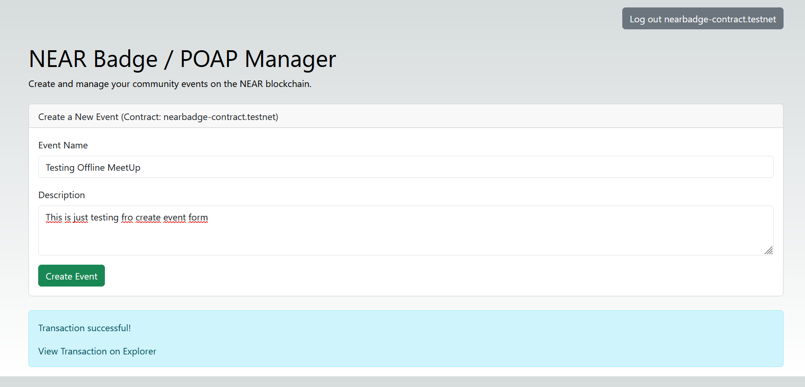

# NEAR Badge – Frontend Application


Web application for the **NEAR Badge (POAP)** project. Built with **React + Vite**, this application provides a complete, multi-page interface for users and event organizers to interact with the NEAR Badge smart contract.

---

## ✨ Core Features

-   **Multi-Page Experience** – Seamless navigation with React Router (`Dashboard`, `Event Whitelist`, `My Badges`, etc.).
-   **Role-Based UI** – Dynamic interface that shows relevant controls (e.g., **Create Event**, **Manage Whitelist**) only for authorized **Admin / Organizer** accounts.
-   **Simplified Event Creation** – Organizers only need to provide a name and description; the application automatically assigns a unique, pre-loaded badge image to the event.
-   **"My Badges" Gallery** – A dedicated page for users to view their collection of claimed NFT badges.
-   **Whitelist Management**
    -   **CSV Upload** – Easily import attendee lists (e.g., from Luma) using Papa Parse.
    -   **Manual Add** – Quickly add late registrants one by one.
    -   **Real-Time Whitelist View** – See current attendees before the event.
-   **NFT Badge Claiming** – Whitelisted users can mint their event badge with one click from the event list, eliminating manual input errors.
-   **Interactive Transaction Toasts** – Each on-chain action provides instant feedback with a direct link to the transaction on NEAR Explorer.
-   **Responsive UI** – Chakra UI components ensure a clean, modern experience on desktop & mobile.

---

## 🚀 Optimizations

-   **Client-Side Caching** – Implements an in-memory cache for frequently requested, slow-changing data (like event lists and user roles). This results in a faster, near-instantaneous UI experience and significantly reduces RPC calls.
-   **RPC Rate Limiting** – A client-side safeguard is in place to prevent spamming the RPC endpoint with excessive requests, ensuring a stable connection.

---

## 🛠 Technology Stack

| Layer | Tool / Library |
| :--- | :--- |
| **Framework** | React + Vite |
| **UI** | Chakra UI |
| **Routing** | React Router |
| **CSV Parse** | Papa Parse |
| **Blockchain** | `@near-wallet-selector` |

---

## 🔗 Smart Contract

This frontend connects to the smart contract located at the following repository:

➡️ **[github.com/Psianturi/near-badge-contract](https://github.com/Psianturi/near-badge-contract)**

---

## 🏁 Getting Started

Follow these steps to run the project on your local machine.

### Prerequisites

Ensure you have the following installed:
- Node.js (v20 or later)
- npm or yarn

### Installation & Running

1.  **Clone this repository:**
    ```bash
    git clone [https://github.com/Psianturi/near-badge-app.git](https://github.com/Psianturi/near-badge-app.git)
    ```

2.  **Navigate into the project directory:**
    ```bash
    cd near-badge-app
    ```

3.  **Install dependencies:**
    ```bash
    npm install
    ```
    
4.  **Configure Environment Variables:**
    Create a file named `.env` in the root of the project and add your contract account ID:
    ```env
    VITE_CONTRACT_NAME=your-contract-name.testnet
    ```

5.  **Run the development server:**
    ```bash
    npm run dev
    ```

---

## 📸 Screenshots

**Attendee View**



**Admin/Organizer View**


