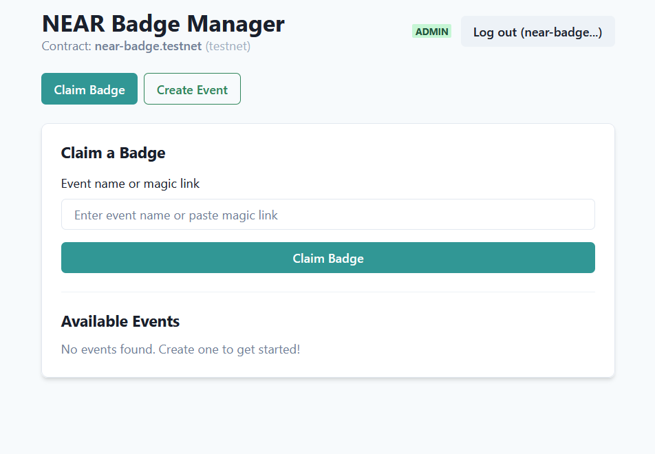
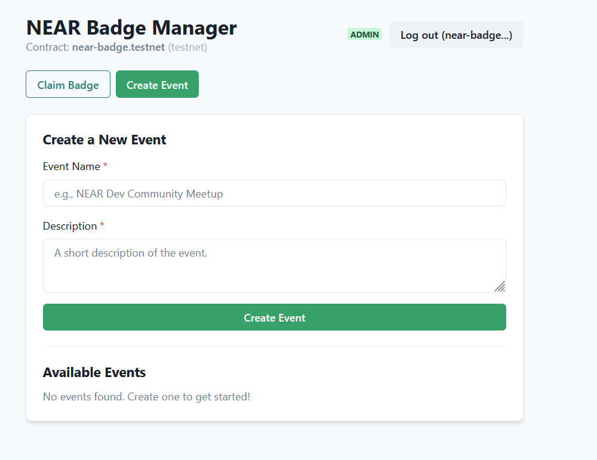

# NEAR Badge - Frontend Application


The official web application for the NEAR Badge (POAP) project. Built with React and Vite, this application provides an intuitive interface for users and event organizers to interact with the NEAR Badge smart contract.

## Core Features

-   **Seamless Wallet Connection**: Connects to the NEAR Testnet using the official `@near-wallet-selector`.
-   **Role-Based UI**: The interface dynamically adapts based on the user's role. Special tools, like the "Create Event" panel, are only visible to authorized `ADMIN` or `ORGANIZER` accounts.
-   **On-Chain Event Creation**: Allows authorized organizers to create new events with details stored directly on the blockchain.
-   **Real-time Event Listing**: Displays all available events fetched directly from the smart contract.
-   **NFT Badge Claiming**: Enables whitelisted attendees to easily claim their unique NFT badge for an event.
-   **Responsive Design**: A clean and modern interface built entirely with **Chakra UI**.

## Technology Stack

-   **Framework**: React (using Vite)
-   **UI Library**: Chakra UI
-   **Blockchain Integration**: `@near-wallet-selector`

## Smart Contract

This frontend connects to the smart contract located at the following repository:

➡️ **[github.com/Psianturi/near-badge-contract](https://github.com/Psianturi/near-badge-contract)**

-   **Current Testnet Address:** `near-badge.testnet`

## Getting Started

Follow these steps to run the project on your local machine.

### Prerequisites

Ensure you have the following installed:
-   Node.js (v16 or later)
-   npm or yarn

### Installation & Running

1.  **Clone this repository:**
    ```bash
    git clone [YOUR_FRONTEND_REPO_URL]
    ```

2.  **Navigate into the project directory:**
    ```bash
    cd [YOUR_FOLDER_NAME]
    ```

3.  **Install dependencies:**
    ```bash
    npm install
    ```

4.  **Run the development server:**
    ```bash
    npm run dev
    ```
    The application will be available at `http://localhost:5173`.

## Screenshots

**Attendee View**

**Admin/Organizer View**


