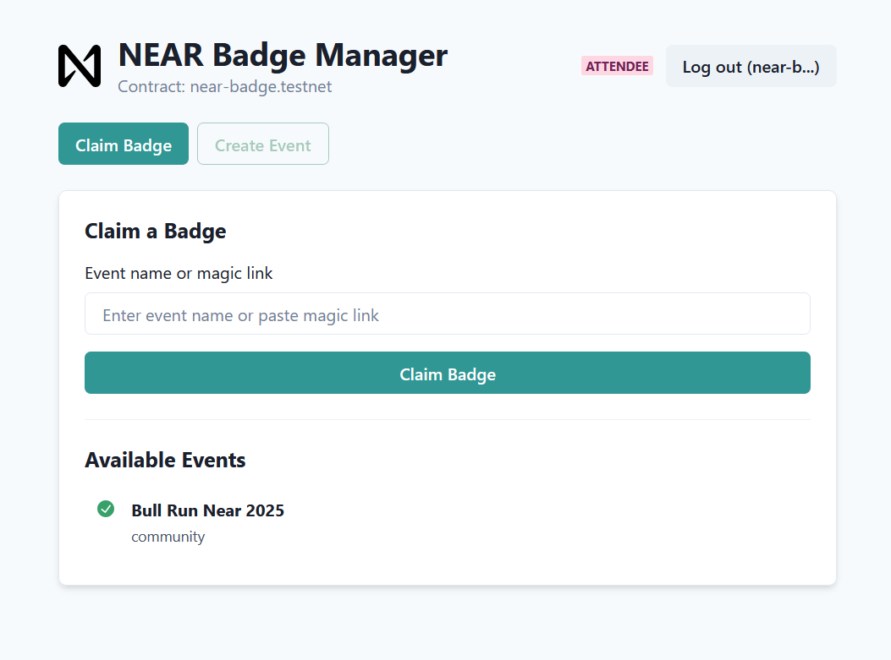
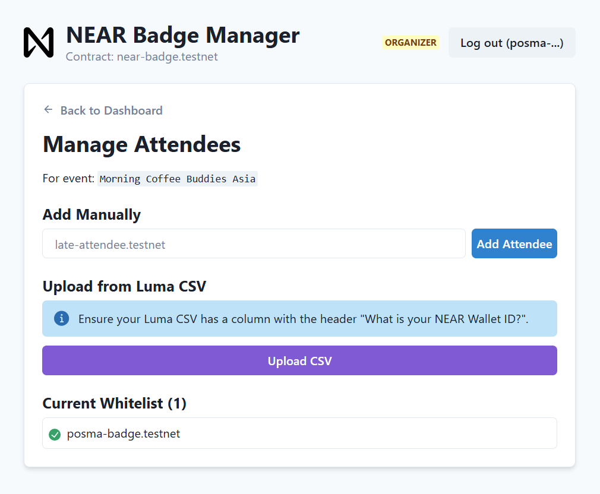
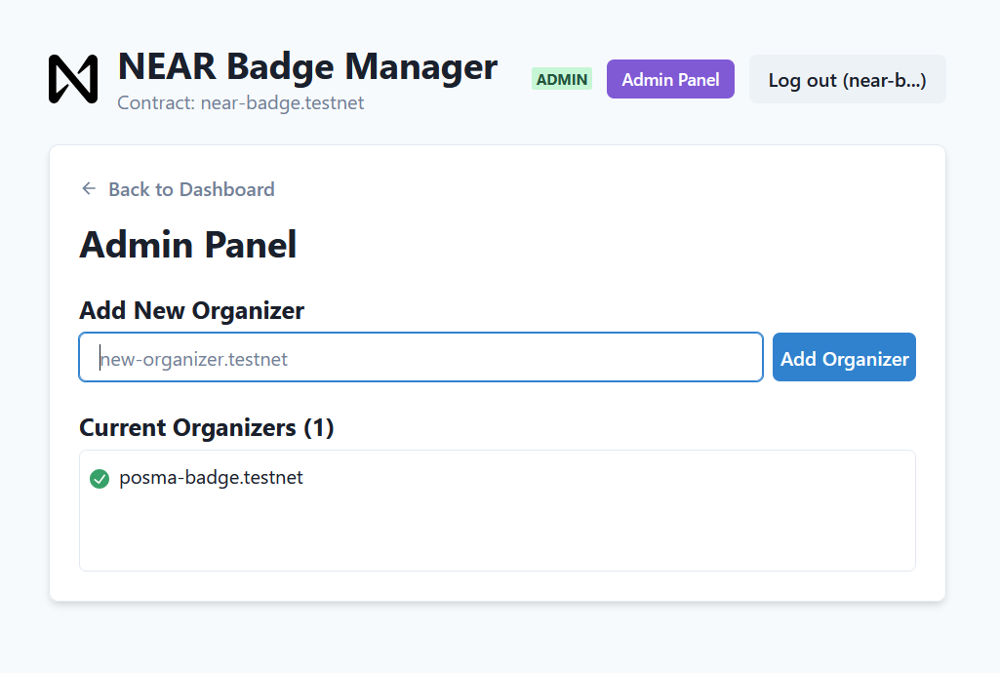

# NEAR Badge – Frontend Application


Web application for the **NEAR Badge (POAP)** project. Built with **React + Vite**, this application provides a complete, multi-page interface for users and event organizers to interact with the NEAR Badge smart contract.

---

## ✨ Core Features

- **Multi-Page Experience** – Seamless navigation with React Router (Dashboard, Event Whitelist, My Badges, etc.).
- **Role-Based UI** – Buttons like **Create Event**, **Manage Whitelist**, and **Delete Event** only show for authorized **Admin / Organizer** accounts.
- **Whitelist Management**
  - **CSV Upload** – Import attendee lists (e.g., from Luma) using Papa Parse.
  - **Manual Add** – Quickly add late registrants one by one.
  - **Real-Time Whitelist View** – See current attendees before the event.
- **Magic Link** – Generate an instant `?event=xyz` link for attendees to claim badges directly.
- **NFT Badge Claiming** – Whitelisted users can mint their event badge with one click.
- **Event Deletion** – Admins & Organizers can safely remove obsolete events (🗑️ with confirmation).
- **Interactive Transaction Toasts** – Each on-chain action includes a NEAR Explorer link.
- **Responsive UI** – Chakra UI components ensure a clean, modern experience on desktop & mobile.

---

## 🛠 Technology Stack

| Layer      | Tool / Library |
|------------|----------------|
| Framework  | React + Vite   |
| UI         | Chakra UI      |
| Routing    | React Router   |
| CSV Parse  | Papa Parse     |
| Blockchain | `@near-wallet-selector` |

---

## 🔗 Smart Contract

This frontend connects to the smart contract located at the following repository:

➡️ **[github.com/Psianturi/near-badge-contract](https://github.com/Psianturi/near-badge-contract)**


## Getting Started

Follow these steps to run the project on your local machine.

### Prerequisites

Ensure you have the following installed:
-   Node.js (v20 or later)
-   npm or yarn

### Installation & Running

1.  **Clone this repository:**
    ```bash
    git clone [REPO_URL]
    ```

2.  **Navigate into the project directory:**
    ```bash
    cd [YOUR_FOLDER_NAME]
    ```

3.  **Install dependencies:**
    ```bash
    npm install
    ```

4.  **Run the development server:**
    ```bash
    npm run dev
    ```

## Screenshots

**Attendee View**



**Admin/Organizer View**


