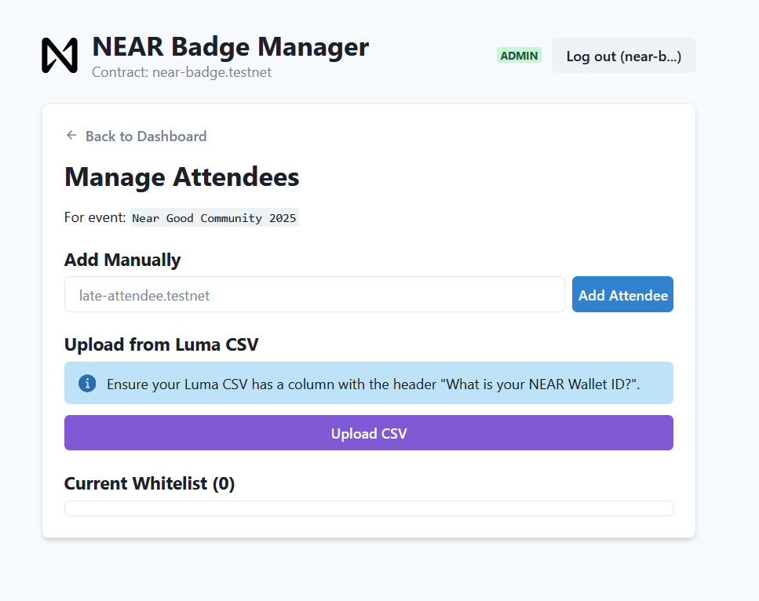

# NEAR Badge - Frontend Application

This is the official frontend for the NEAR Badge (POAP) project. It's a React-based web application built with Vite that allows users and event organizers to interact with the NEAR Badge smart contract on the NEAR blockchain.

## Screenshot


## Core Features (Current)
- **Wallet Connection:** Connects to the NEAR Testnet using the official `@near-wallet-selector`, with support for MyNearWallet, Sender, and Ledger.
- **Event Creation:** Allows the contract owner to log in and create new events by submitting a name and description directly to the smart contract.

## Technology Stack
- **Framework:** React (with Vite)
- **Wallet Integration:** `@near-wallet-selector`
- **Styling:** Bootstrap
- **Blockchain:** NEAR Protocol (Testnet)

## Getting Started (Running Locally)

To run this project on your local machine, follow these steps:

1.  **Clone the repository:**
    ```bash
    git clone [https://github.com/Psianturi/near-badge-app.git](https://github.com/Psianturi/near-badge-app.git)
    ```
2.  **Navigate to the directory:**
    ```bash
    cd near-badge-app
    ```
3.  **Install dependencies:**
    ```bash
    npm install
    ```
4.  **Run the development server:**
    ```bash
    npm run dev
    ```
The application will be available at `http://localhost:5173`.

## Smart Contract
This frontend connects to the smart contract located at the following repository:

➡️ **[near-badge-contract](https://github.com/Psianturi/near-badge-contract)**

- **Current Testnet Address:** `nearbadge-contract.testnet`

## Roadmap & Next Steps
- [ ] **UI/UX Enhancements:** Improve the overall design and user experience.
- [x] **Add More Wallets:** Integrate support for more wallets, including Meteor Wallet. *(Anda bisa mencentangnya setelah kita menambahkannya)*
- [ ] **Whitelist Management:** Build the UI for organizers to manage attendee whitelists.
- [ ] **Badge Claiming Page:** Create the page for attendees to claim their POAP badges.
- [ ] **Mainnet Preparation:** Audit and prepare for a full launch on the NEAR mainnet.


